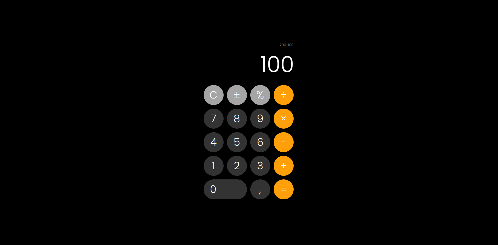

<h1 align="center"> Calculadora Online </h1>

Calculadora desenvolvida apenas com o basico, como forma de estudo.

  <a href="#-tecnologias">Tecnologias</a>&nbsp;&nbsp;&nbsp;|&nbsp;&nbsp;&nbsp;
  <a href="#-projeto">Projeto</a>&nbsp;&nbsp;&nbsp;|&nbsp;&nbsp;&nbsp;
  <a href="#memo-licença">Licença</a>

  

 

## 🚀 Tecnologias

Esse projeto foi desenvolvido com as seguintes tecnologias:

- HTML e CSS
- JavaScript
- Git e Github

## 💻 Projeto

- O projeto em questão é uma calculadora desenvolvida apenas com tecnologias básicas na web.
- O visual da calculadora é inspirada na calculadora do iPhone.
- Este projeto se iniciou como um projeto de estudos e acabou se tornando projeto de passa-tempo deste desenvolvedor que lhes escreve, portanto novas atualizações no projeto sempre irão ocorrer.

- Você pode testar este projeto [Por Aqui](https://brunoknop.github.io/calculadoraOnline/), caso queira

## :memo: Licença

Esse projeto está sob a licença MIT.

---

Feito com ❤ pelo Bruno Knop
